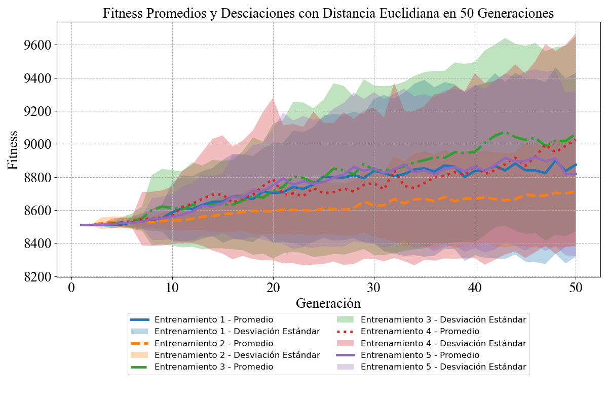
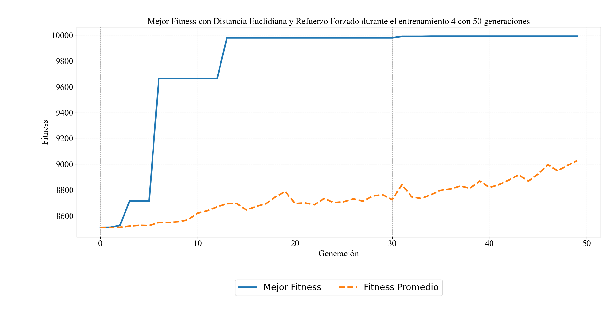
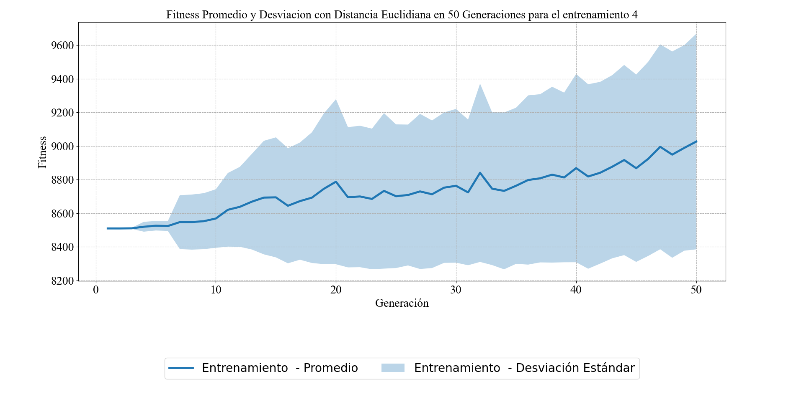

# Adaptive Navigation System for an Autonomous Vehicle in a Goal-Oriented Environment ID: 9559

#### Autores: Over Alexander Mejia-Rosado (omejiar@unal.edu.co), Ronald Mateo Ceballos-Lozano (rceballosl@unal.edu.co), Rhonald Jose Torres-Diaz (rhtorresd@unal.edu.co) and Juan Pablo Hoyos-Sanchez (jhoyoss@unal.edu.co) hacen parte de la Universidad Nacional de Colombia, Sede De La Paz.

Proyecto en desarrollo de Inteligencia Artificial que se enfoca en la creación de un sistema de navegación para vehículos autónomos. Este sistema utiliza NEAT para el aprendizaje automático y técnicas de procesamiento de datos para permitir que un vehículo se desplace en un mapa de 2D.

## Descripción

El proyecto **Navegacion_Vehiculo_Autonomo** tiene como objetivo desarrollar una solución integral para la navegación autónoma de vehículos. Mediante el uso de sensores y procesamiento en tiempo real, el sistema es capaz de detectar y evitar obstáculos. Las principales funcionalidades incluyen:

- **Detección de Obstáculos:** Utilización de sensores para identificar y localizar obstáculos en el entorno del vehículo.
- **Planificación de Rutas:** Algoritmos que calculan la ruta más eficiente desde el punto A hasta el punto B, para eso se hace uso de la distancia Euclidiana, Manhattan y Chebyshev.
- **Toma de Decisiones:** Redes neuronales que procesan la información de los sensores para tomar decisiones en tiempo real.
- **Integración de Sensores:** Combinación de datos de múltiples entradas para una percepción precisa del entorno.

### Contenido del respositorio

En las carperas Chebyshev, Euclidiana y Manhattan, encontrará un archivo .py para la ejecución de la simulación. Cada uno consta con la función fitness aplicadno la distancia seleciona, en caso de que seleccione la distancia Manhattan, el calculo fitness correspondiente, estaría dado de la sigueinte manera:

```python
   def calculate_fitness(self):
        distance_to_goal = self.calculate_manhattan_distance(self.map.lista_objetivo[0])
        fitness = max(
            0, 10000 - distance_to_goal
        )  # Ajusta el valor base según sea necesario
        return fitness

     def calculate_manhattan_distance(self, target_position):
        dx = abs(self.center[0] - target_position[0])
        dy = abs(self.center[1] - target_position[1])
        return dx + dy
```

Para variar la cantidad de genreaciones que desea en cada simulación, modifique la función:

```python
def run_neat(self, config):
        population = neat.Population(config)
        population.add_reporter(neat.StdOutReporter(True))
        stats = neat.StatisticsReporter()
        population.add_reporter(stats)
        winner = population.run(self.eval_genomes, 50) # 50 genracones, variar segun las geraciones que desea
```

## Requisitos

- Python 3.12.3
- pygame==2.6.1
- neat-python==0.92

## Instalación

1. Clonar el repositorio:
   ```bash
   git clone https://github.com/usuario/Navegacion_Vehiculo_Autonomo.git
   ```
2. Navegar al directorio del proyecto:
   ```bash
   cd Navegacion_Vehiculo_Autonomo
   ```
3. Instalar las dependencias:
   ```bash
   pip install -r requirements.txt
   ```

## Ejecución

Si ha isntaldo correctamente las dependencias, el sigueinte paso es ejecutar el archivo para vesualizar la simulación, por ejemplo en Windows:

```bash
python .\Euclidiana\Euclidiana.py
```

En el directorio de ejecución, se generan dos archivos .csv que continen los fitness obtenidos por los agentes en la simulación. Con estos archivos usted podra analizar los fitness promedio de cada simulacion, las desviaciones y fitness maximos.

### Crear las graficas

Dentro del repositorio podrá observar la carpeta `📂 Graps`, en ella encontrará el script `graphical_all_fitness.py` que le permitirá graficar de forma conjunta todas las simulaciones que usted ha realizado, por otra parte el script `graphical_best_fitness.py` le permite graficar los resultados de cada simulación.

#### Aplicación:

Se realizaron distintas simulaciones, los resultados se guardaron como `datos_fitness{index}.csv` y `fitness_individual{index}.csv` donde `{index}` pertenece al numero de la simulacion, es decir, si ejecuta por primera vez el script `Euclidiana.py`, a los **_.csv_** generados, se les asigno el nombre de `datos_fitness1.csv` y `fitness_individual1.csv`, así para cada ejecución. Observe el directorio `📂 Euclidiana/Eucli_50Gen`, ahí se encuentran todos los datos generados en cada ejecución de forma ordenada.

Para graficar los datos dirijase al script `graphical_all_fitness.py`, establezca el directorio donde estan los datos y como los nombró, asegúsere de guardar los cambios:

```python
   directorio="./Euclidiana/Eucli_50Gen",
   prefix="fitness_individual",
   extension=".csv",
```

Para finalizar, ejecute, si está en Wondows:

```bash
   python .\Graps\graphica_all_fitness.py
```

Como resultado obtendrá la siguinte grafica:



Para graficar los resultados obtenidos de cada simulación por separado, configrure la ruta de los archivos **_.csv_** en `graphical_best_fitness.py`. Como resultado:



Si desea saber, el primedio y desviación por entrenamiento, tambien puede usar `graphical_all_fitness.py`, especificando que entrenamiendo quiere graficar, por ejmeplo para el cuarto entrenamiento:

```python
   directorio="./Euclidiana/Eucli_50Gen",
   prefix="fitness_individual4",
   extension=".csv",
```



## Autores

- Over Alexander Mejia Rosado
- Ronald Mateo Ceballos Lozano
- Rhonald Jose Torres Diaz
- Juan Pablo Hoyos Sanchez (Docente)
